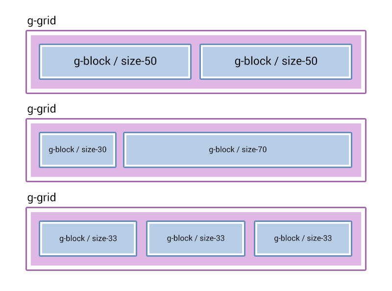

Sometimes, you will want to create custom responsive content within the bounds of a simple content area. For example, within an article/post on your site, as opposed to being created dynamically through a particle.

The way this is done in Gantry 5 is a lot easier than it was in Gantry 4. Gantry 5 comes with a built-in and lightweight CSS framework that we called `Nucleus`. Nucleus main focus is to provide a flex-ready layout. This means that if you just follow a few rules in building your responsive layout, you will never have a problem, no matter how deep your layout is going to be.

For your content you will only need to know about 3 types of classes that come with `Nucleus`:

#### `g-grid`
This is the container of your content surroundings and side-by-side columns. A grid (or row), will always occupy entirely the space it's been added to. Think of it as a 100% wide `div`.

A `g-grid` can contain only `g-block` elements in it, nothing else. This is important in order to have the flex-grid working responsively.

#### `g-block` and `size-%`
This is the container of your actual content. A `g-block`, by default, is `100%` wide and in it you can put any desired content, whether it's an image, a paragraph or even another `g-grid > g-block` layout.

When your `g-block` is accompanied by a `size-%` class, you can change its default `100%` size. Sizes can go from `5` to `95` with a multiplier of `5`.

The available custom widths are `.size-5 .size-10`, `.size-15`, `.size-20`, `.size-25`, `.size-30`, `.size-33`, `.size-40`, `.size-50`, `.size-60`, `.size-66`, `.size-70`, `.size-75`, `.size-80`, `.size-85`, `.size-90 .size-95`.

In **mobile** view, these blocks will stack on top of each other while in **tablet** or **desktop** view, these blocks will scale responsively.

> When you have multiple blocks inside a grid, make sure that the size of the blocks sum up to 100%




The structure is always going to be the same, first a `grid` then a `block`, inside the block goes your final content which might include another `grid` and another `block`.

```
.g-grid
    .g-block.size-50
        [your content for left column]
    .g-block.size-50
        [your content for right column]
```

## Example 1


In this example we create a one row/four column pricing table.

```html
<div class="g-grid">
    <div class="g-block size-100">
        <h3 class="center">All plans come with awesome support by email and phone. There is no hidden fee!</h3>
    </div>
</div>

<div class="g-grid">
    <!-- Column1 - Basic -->
    <div class="g-block size-25 equal-height">
        <ul style="list-style: none; border: 1px solid gray; padding: 1rem; margin: 1rem;">
            <li class="alert alert-success center">Basic</li>
            <li class="center"><h2>$28</h2></li>
            <li>Globally incubate standards compliant channels</li>
            <li>5GB Storage</li>
            <li>10 Users</li>
            <li>20 Emails</li>
            <li class="button button-2"><a href="#">Sign Up</a></li>
        </ul>
    </div>
    <!-- Column2 - Standard -->
    <div class="g-block size-25 equal-height">
        <ul style="list-style: none; border: 1px solid gray; padding: 1rem; margin: 1rem;">
            <li class="alert alert-info center">Standard</li>
            <li class="center"><h2>$58</h2></li>
            <li>Globally incubate standards compliant channels</li>
            <l>25GB Storage</li>
            <li>20 Users</li>
            <li>30 Emails</li>
            <li class="button button-2"><a href="#">Sign Up</a></li>
        </ul>
    </div>
    <!-- Column3 - Titanium -->
    <div class="g-block size-25 equal-height">
        <ul style="list-style: none; border: 1px solid gray; padding: 1rem; margin: 1rem;">
            <li class="alert alert-warning center">Titanium</li>
            <li class="center"><h2>$88</h2></li>
            <li>Globally incubate standards compliant channels</li>
            <li>50GB Storage</li>
            <l>30 Users</li>
            <li>40 Emails</li>
            <li class="button button-2"><a href="#">Sign Up</a></li>
        </ul>
    </div>
    <!-- Column4 - Platinum -->
    <div class="g-block size-25 equal-height">
        <ul style="list-style: none; border: 1px solid gray; padding: 1rem; margin: 1rem;">
            <li class="alert alert-error center">Platinum</li>
            <li class="center"><h2>$288</h2></li>
            <li>Globally incubate standards compliant channels</li>
            <li>500GB Storage</li>
            <li>100 Users</li>
            <li>200 Emails</li>
            <li class="button button-2"><a href="#">Sign Up</a></li>
        </ul>
    </div>
</div>
```

## Example 2


This is a straight forward example of a one row/four column presentation of alternating text content and images.

```html
<div class="g-grid">
    <div class="g-block size-100">
        <h3 class="center">Free
            <strong>10 days trial</strong>on all plans. No credit card needed! Need a bigger plan?
            <a href="#" </a>.</h3>
    </div>
</div>
<div class="g-grid">
    <!-- Row1 Column1 - Text -->
    <div class="g-block size-25">
        <a href="#">Dropdown Menu</a>
        <p>A Dropdown Menu system, with inline icons, multiple columns and much more.</p>
        <p>
            <a href="#" class="button button-3 button-small">Learn More</a>
        </p>
    </div>
    <!-- Row1 Column2 - Image -->
    <div class="g-block size-25">
        <div style="margin: 1rem;">
            
        </div>
    </div>
    <!-- Row1 Column3 - Text -->
    <div class="g-block size-25">
        <a href="#">Positions</a>
        <p>Unlimited positions, with drag and drop add, delete, move and resize capabilities.</p>
        <p>
            <a href="#" class="button button-3 button-small">Learn More</a>
        </p>
    </div>
    <!-- Row1 Column4 - Image -->
    <div class="g-block size-25">
        <div style="margin: 1rem;">
            
        </div>
    </div>
</div>
```

! The images used in our examples are based on ones that appear in the default Joomla installation. Your particular CMS / installation may differ. Any image links should be replaced with ones that reflect your own files.

You can see by these images how `g-grid` and `g-block` references are used. Grids form horizontal spaces and blocks are columned content within the grid. Size variables `size-25` determine what percentage of width each block takes up. So, for example, you would pair a `size-75` block with a `size-25` to create a horizontal space with a large left-hand column and a smaller right-hand column.
